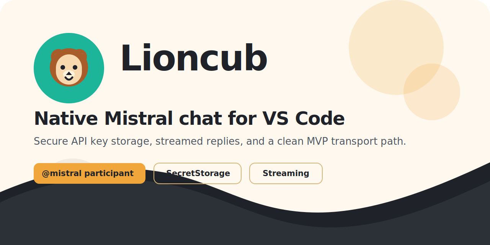

# Lioncub

<p align="center">
  
</p>

<p align="center">
  Native Mistral chat for VS Code with secure key handling, streamed responses, and a clean MVP transport path.
</p>

## What This Repository Is

`lioncub-releases` is the distribution repository for Lioncub VS Code extension packages.

This repository exists to host GitHub Releases and attached `.vsix` assets. The extension source code lives in the separate `nikan/lioncub` repository.

## Install

Download the latest `.vsix` package from the [Releases page](https://github.com/nikan/lioncub-releases/releases).

Install it with:

```bash
code --install-extension lioncub-<version>.vsix
```

You can also install the `.vsix` from the VS Code Extensions view if you prefer a UI flow.

## What Gets Published Here

- GitHub Releases for Lioncub versions
- versioned `.vsix` assets such as `lioncub-<version>.vsix`
- lightweight release-facing documentation

## What Does Not Belong Here

- source code copied from `nikan/lioncub`
- committed `.vsix` files in git history
- build output directories
- local development sources such as `src/`, `test/`, or `node_modules/`

## Source of Truth

The private source repository is `nikan/lioncub`.

Release builds are created there and published here through GitHub Actions using `RELEASE_TOKEN`. This repository is the distribution target, not the build source.

## Release Notes Expectations

Lioncub releases in this repository should include:

- the version tag
- the packaged `.vsix` asset
- a link back to the source commit in `nikan/lioncub`
- an install snippet using `code --install-extension`
